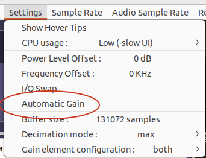
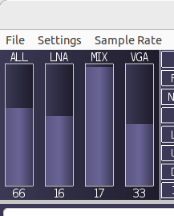
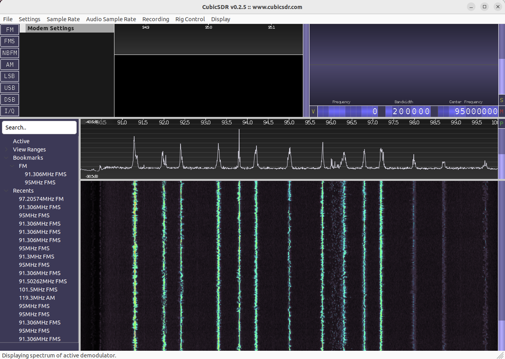

# using this with CubicSDR

## Install soapysdr, cubicsdr & friends

```
$ sudo apt install cubicsdr libsoapysdr-dev soapysdr-tools
```

## Build libpg2sdr and the soapy module

```
$ cd ~/git/liblpcsdr
$ make
```

## Set env vars

```
$ export SOAPY_SDR_PLUGIN_PATH=$HOME/git/liblpcsdr/build/soapy
$ export PG2SDR_FIRMWARE=$HOME/git/libpg2sdr/firmware/images/pg2sdr.bin
$ export SOAPY_SDR_LOG_LEVEL=DEBUG
```

If your source code is not in $HOME/git/liblpcsdr, update those paths to match
whereever it is.

## Ensure that the PG2SDR has firmware loaded

The SoapySDR driver won't automatically load firmware. If needed, run any of
the python scripts once to load firmware:

```
$ firmware/python/status.py
```

## Check that the pg2sdr driver works OK standalone:

```
$ SoapySDRUtil --find
######################################################
##     Soapy SDR -- the SDR abstraction library     ##
######################################################

[DEBUG] PG2SDR: FindDevices("")
[...]
[DEBUG] candidate: address=2, bus=1, driver=pg2sdr, index=0, label=ProStick Gen 2 @ 1:11 s/n 386297DBD86461DC, ports=11, serial=386297DBD86461DC
Found device 0
  address = 2
  bus = 1
  driver = pg2sdr
  index = 0
  label = ProStick Gen 2 @ 1:11 s/n 386297DBD86461DC
  ports = 11
  serial = 386297DBD86461DC
```

```
$ SoapySDRUtil --args="driver=pg2sdr" --rate=10000000 --direction=RX --channels=0
######################################################
##     Soapy SDR -- the SDR abstraction library     ##
######################################################

[DEBUG] PG2SDR: FindDevices("driver=pg2sdr")
[DEBUG] candidate: address=2, bus=1, driver=pg2sdr, index=0, label=ProStick Gen 2 @ 1:11 s/n 386297DBD86461DC, ports=11, serial=386297DBD86461DC
[DEBUG] PG2SDR: MakeDevice("address=2, bus=1, driver=pg2sdr, index=0, label=ProStick Gen 2 @ 1:11 s/n 386297DBD86461DC, ports=11, serial=386297DBD86461DC")
[DEBUG] LNA gain range [0.0,27.6] dB
[DEBUG] MIX gain range [0.0,17.4] dB
[DEBUG] VGA gain range [7.1,57.8] dB
[DEBUG] Total gain range [8.4,97.5] dB
[DEBUG] PG2SDR: constructed 0xaaaad89f65e0 with libpg2sdr handle 0xaaaad89eb030
[DEBUG] PG2SDR: setSampleRate(1,0,10000000)
[DEBUG] libpg2sdr: ADC sample rate changes to 20.000000 MHz with 0 post-decimation steps (divide-by-1)
[DEBUG] libpg2sdr: IF bandpass filter constraints: signal (0.000 .. 10.000), Nyquist (0.000 .. 10.000) MHz
[DEBUG] libpg2sdr: set IF bandpass = 0.580MHz .. 10.092MHz (15/0/0/3/0)
[DEBUG] PG2SDR: getNativeStreamFormat(1,0)
[DEBUG] PG2SDR: setupStream(1,CS16,[1 items],"")
[DEBUG]  = 0xaaaad89f1d10
Stream format: CS16
Num channels: 1
Element size: 4 bytes
Begin RX rate test at 10 Msps
[DEBUG] PG2SDR: getStreamMTU(0xaaaad89f1d10)
Starting stream loop, press Ctrl+C to exit...
[DEBUG] PG2SDR: activateStream(0xaaaad89f1d10,0,0,0)
[DEBUG] PG2SDR: activating the streaming thread
[DEBUG] PG2SDR: streaming thread started
[DEBUG] libpg2sdr: allocate_transfers: 
  buffer_size              131072
  usb_transfer_size        389120
  adc_samples_per_transfer 258704
  transfer_count           19
  transfer_timeout_ms      745

[DEBUG] libpg2sdr: starting ADC transfers with:
  N: 0
  M: 15.00000
  P: 9
  I: 0
  fCCO: 360.00 MHz
  fADC: 20.00 MHz

[DEBUG] libpg2sdr: ADC overrun
|^C[DEBUG] PG2SDR: deactivateStream(0xaaaad89f1d10,0,0)
[DEBUG] PG2SDR: deactivating the streaming thread
[DEBUG] libpg2sdr: pg2sdr_stream_data: something set the draining flag, stopping
[DEBUG] PG2SDR: streaming thread terminated
[DEBUG] PG2SDR: done with deactivating the streaming thread
[DEBUG] PG2SDR: closeStream(0xaaaad89f1d10)
[DEBUG] PG2SDR: deactivateStream(0xaaaad89f1d10,0,0)
[DEBUG] PG2SDR: dtor called for 0xaaaad89f65e0
```

## Start cubicsdr

```
$ CubicSDR
```

## Configure cubicsdr

You should see the PG2SDR in the device list. Select it and click Start.

You should now have a waterfall display running.

## Tuning

The complex baseband stuff is working now, so the tuned center
frequency (top right corner of CubicSDR) controls the center of the
tuned band, i.e. the "zero" frequency in the baseband data. The PG2SDR
will capture a chunk of the spectrum surrounding that center
frequency, with a total width = the configured sample
rate. Internally, the tuner PLL will actually be tuned to one edge of
that band. e.g. if you tune to a center frequency of 95MHz, with a
(complex) sampling rate of 10MHz, then the tuner PLL will be tuned to
90MHz and the ADC will run at 20MHz, capturing frequencies between
90MHz - 100MHz.

## Gain

In the Settings menu, make sure that automatic gain is _disabled_:



Now you should have gain settings available at the top left:



Clicking on the bars changes the gain. The numbers are in approximate dB.

The "ALL" bar controls the total gain of all stages. Changing the
"ALL" gain will change the LNA/MIX/VGA settings based on the gain
curve that libpg2sdr uses. Vice versa, changing the LNA/MIX/VGA
settings will update the ALL gain to the approximate total gain.

## Interpreting the waterfall

Now that we're using complex baseband, there's nothing special here, it's a
direct interpretation of a chunk of the spectrum with no mirroring.

It should look something like this:



## Listen to some FM radio!

Hook up an antenna and poke around the FM spectrum. You can change the
center frequency by clicking the top/bottom parts of each frequency
digit, or using the mousewheel there. Clicking on the waterfall will
center a FM demodulator on that frequency and you should get some
audio output, all going well ...
