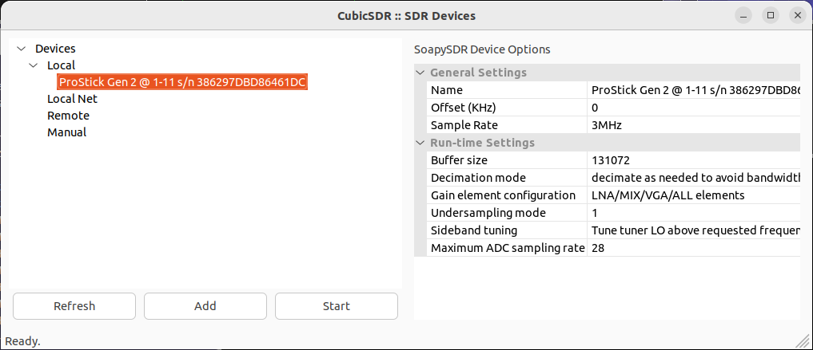

# Using the SoapySDR driver

After [installing libpg2sdr and the SoapySDR driver](install.md),
use `SoapySDRUtil` to [check your install is working correctly]
(install.md#verify-that-your-soapysdr-driver-installation-is-working).

Now you should be able to use the ProStick Gen 2 with any
software that has SoapySDR support.

For interactive applications e.g. `CubicSDR`, usually you will be able to
directly select the correct device from a dialog:



For command-line applications, you'll usually need to provide a
"device string" to identify the device to use. This is a
comma-separated list of key=value pairs that uniquely identifies a
SoapySDR device.

For a ProStick Gen 2 device, the device string must include
`driver=pg2sdr` to identify the driver to use. If more than one device
is connected, you can select a particular device by port or by serial
number. The exact string to use can be found from `SoapySDRUtil
--find`. For example, given this output:

```bash
SoapySDRUtil --find
```

```
######################################################
##     Soapy SDR -- the SDR abstraction library     ##
######################################################

Found device 0
  driver = pg2sdr
  label = ProStick Gen 2 @ 1-11 s/n 386297DBD86461DC
  ports = 1-11
  serial = 386297DBD86461DC
```

Some possible device strings for this device are:

 * `driver=pg2sdr,ports=1-11` (selecting device by physical USB port)
 * `driver=pg2sdr,serial=38629` (selecting device by serial number prefix)
 * `driver=pg2sdr,serial=386297DBD86461DC` (selecting device by full serial number)

To test a device string, pass it to `SoapySDRUtil --find`:

```bash
SoapySDRUtil --find=driver=pg2sdr,serial=38629
```

```
######################################################
##     Soapy SDR -- the SDR abstraction library     ##
######################################################

Found device 0
  driver = pg2sdr
  label = ProStick Gen 2 @ 1-11 s/n 386297DBD86461DC
  ports = 1-11
  serial = 386297DBD86461DC
```
