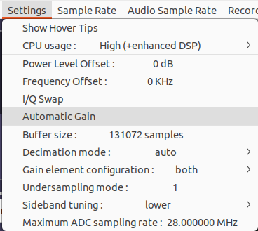
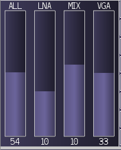

# Using the SoapySDR driver

SoapySDR is a SDR abstraction layer that provides a common interface
to many different types of SDR. libpg2sdr provides a driver module
for the ProStick Gen 2 that allows it to be used with SoapySDR.

## Basic setup

After [installing libpg2sdr and the SoapySDR driver](install.md),
use `SoapySDRUtil` to
[check your install is working correctly](install.md#verify-that-your-soapysdr-driver-installation-is-working).

Now you should be able to use the ProStick Gen 2 with any
software that has SoapySDR support.

For interactive applications e.g. `CubicSDR`, usually you will be able to
directly select the correct device from a dialog:


For command-line applications, you'll usually need to provide a
"device string" to identify the device to use. This is a
comma-separated list of key=value pairs that uniquely identifies a
SoapySDR device.

For a ProStick Gen 2 device, the device string must include
`driver=pg2sdr` to identify the driver to use. If more than one device
is connected, you can select a particular device by port or by serial
number. The exact string to use can be found from `SoapySDRUtil
--find`. For example, given this output:

```bash
SoapySDRUtil --find
```

```
######################################################
##     Soapy SDR -- the SDR abstraction library     ##
######################################################

Found device 0
  driver = pg2sdr
  label = ProStick Gen 2 @ 1-11 s/n 386297DBD86461DC
  ports = 1-11
  serial = 386297DBD86461DC
```

Some possible device strings for this device are:

* `driver=pg2sdr,ports=1-11` (selecting device by physical USB port)
* `driver=pg2sdr,serial=38629` (selecting device by serial number prefix)
* `driver=pg2sdr,serial=386297DBD86461DC` (selecting device by full serial number)

To test a device string, pass it to `SoapySDRUtil --find`:

```bash
SoapySDRUtil --find=driver=pg2sdr,serial=38629
```

```
######################################################
##     Soapy SDR -- the SDR abstraction library     ##
######################################################

Found device 0
  driver = pg2sdr
  label = ProStick Gen 2 @ 1-11 s/n 386297DBD86461DC
  ports = 1-11
  serial = 386297DBD86461DC
```

## SoapySDR settings

SoapySDR provides a way for drivers to expose device-specific
settings. You can see the available settings in the output of
`SoapySDRUtil --probe`. The ProStick Gen 2 driver provides these
settings:

* `decimation`: adds additional decimation stages to the receive
  processing path. This can be an integer number of stages, or "auto"
  (the default) to add decimation stages when needed to avoid problems
  with the tuner bandpass filter. See the libpg2sdr API documentation
  for more details.

* `adc_limit`: Set the maximum ADC sampling rate that will be used, in
  MHz. This can be used to limit the total USB bandwidth used if the
  USB bus is shared with other devices, or to reduce CPU or power
  consumption. The default is 28MHz, which will use most of the
  available USB bandwidth.

* `gain_config`: controls how gain elements are exposed in the SoapySDR
  API. If an application struggles with gain setting, you may need
  to change this. Possible values are:

    * `individual`: provide `VGA`, `MIX`, and `LNA` gain stages.
      Total gain can be set separately via the SoapySDR API overload
      that takes a single gain value, but total gain is not separately
      exposed as a gain stage.  This most closely reflects the
      hardware, but applications can be confused if there is no single
      gain control.

    * `total`: provide one gain stage only, `ALL`, which control total
      gain. Individual gain stages are not exposed. This is the
      simplest configuration, but also the least flexible.

    * `both`: The default setting. Provides `VGA`, `MIX`, `LNA`, and
      `ALL`.  Covers all cases, but applications may be confused that
      changing the `ALL` gain affects the other settings (and vice
      versa)

* `buffer_size`: controls the buffer size used to pass data to the
  application. This affects the SoapySDR "stream MTU". The default
  (2626144) is usually fine. You may need to reduce this if using low
  sample rates with a latency-sensitive application.

* `undersampling`: set undersampling mode. Experimental, see the
  libpg2sdr API for more details.

* `sideband`: set tuning sideband. Possible values are:

    * `lower`: Place the tuner LO above the requested center frequency

    * `upper`: Place the tuner LO below the requested center frequency

    * `auto`: The default setting. Selects `lower` or `upper` based on
      the requested center frequency, to slightly extend the available
      tuning range.

## Specific notes for some software

### CubicSDR

[CubicSDR](https://github.com/cjcliffe/cubicsdr) mostly needs no
special configuration and works fairly well with the ProStick Gen 2.

Device settings can be configured from the device selection dialog, or
from the `Settings` menu after selecting a device.

CubicSDR defaults to enabling automatic gain control when a new device
is selected. The ProStick Gen 2 does not provide AGC, so ensure that
this option is turned off in the Settings menu:



The default `gain_setting` setting works acceptably with CubicSDR: use
the "ALL" gain slider to control total gain, or the LNA/MIX/VGA
sliders to individually control gain stages. The displayed values are
in dB:



If you change the `gain_setting` setting after selecting a device, you
may need to reselect the device to see the changes take effect, as
CubicSDR is not expecting the set of available gain stages to change
after the device is set up.

CubicSDR often fails to clean up the SoapySDR device on exit, which
can leave RF power and ADC enabled on the device, unnecessarily
consuming extra power / generating heat. To fix this, run `pg2-util
standby` after exiting CubicSDR.

### dump1090-fa

[dump1090-fa](https://github.com/flightaware/dump1090) has SoapySDR device
support. To use dump1090-fa with a ProStick Gen 2, pass `--device-type soapy`
and `--device driver=pg2sdr` (or your full SoapySDR device string is).

The `--gain` option will set total gain in dB. `dump1090-fa` defaults
to maximum gain if no gain option is given, which on the ProStick Gen
2 tends to overload the receiver to the point where it's completely
deaf. A gain of about 60 is a better starting point.

The `--device-setting` option can be used to pass additional SoapySDR settings
(see above). Most useful is the `decimation` setting; setting `decimation=2`
will help avoid some internal 12MHz interference and also improve the noise
floor:

```bash
dump1090                               \
  --device-type soapy                  \
  --device driver=pg2sdr,serial=386297 \
  --gain 60                            \
  --device-setting decimation=2        \
  [... other options ...]
```

```
Fri Jun  5 10:54:04 2026 +08  dump1090-fa unknown starting up.
soapy: selected device:  driver=pg2sdr, label=ProStick Gen 2 @ 1-11 s/n 386297DBD86461DC, ports=1-11, serial=386297DBD86461DC
soapy: driver key:      pg2sdr
soapy: hardware key:    pg2sdr
soapy: total gain:      59.2dB; LNA=9.8dB; MIX=16.1dB; VGA=32.9dB; ALL=59.2dB
soapy: frequency:       1090.0 MHz
soapy: sample rate:     2.4 MHz
soapy: bandwidth:       3.1 MHz
soapy: antenna:         
```

### dump978-fa

[dump978-fa](https://github.com/flightaware/dump978) has SoapySDR device
support. To use dump978-fa with a ProStick Gen 2, pass `--sdr driver=pg2sdr`
(or your full SoapySDR device string).

The `--sdr-gain` option will set total gain in dB. `dump978-fa` defaults
to maximum gain if no gain option is given, which on the ProStick Gen
2 tends to overload the receiver to the point where it's completely
deaf. A gain of about 60 is a better starting point.

The `--sdr-device-settings` option can be used to pass additional SoapySDR settings
(see above). Pass `decimation=1` to avoid some internal 12MHz interference and
also improve the noise floor:

```bash
dump978-fa \
  --sdr driver=pg2sdr,serial=386297  \
  --sdr-device-settings decimation=2 \
  --sdr-gain 60                      \
  [.. other options ..]
```
