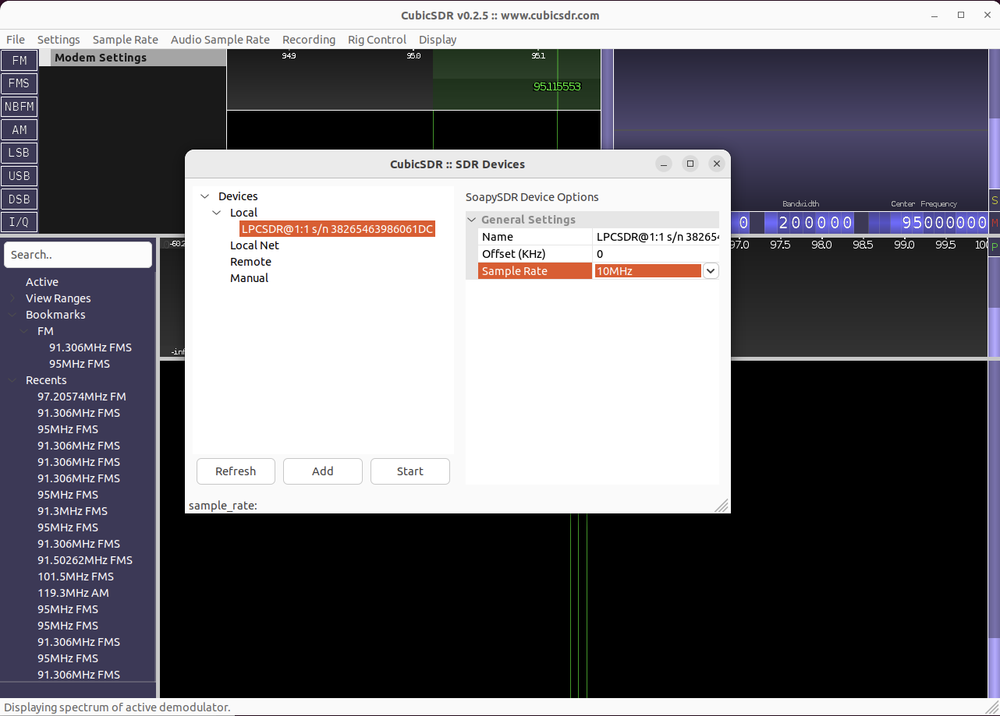

# using this with CubicSDR

## Install soapysdr, cubicsdr & friends

```
$ sudo apt install cubicsdr libsoapysdr-dev soapysdr-tools
```

## Build liblpcsdr

```
$ cd ~/git/liblpcsdr
$ make
```

## Build the soapysdr driver

```
$ cd ~/git/liblpcsdr/soapy
$ make

```

## Set env vars

```
$ export LPCSDR_FIRMWARE=$HOME/git/liblpcsdr/lpcsdr_firmware/images/lpcsdr.bin
$ export SOAPY_SDR_PLUGIN_PATH=$HOME/git/liblpcsdr/soapy
$ export SOAPY_SDR_LOG_LEVEL=DEBUG
```

## Check that the lpcsdr driver works OK standalone:

```
$ SoapySDRUtil --find
[...]
[DEBUG] candidate: address=10, bus=1, driver=lpcsdr, index=0, label=LPCSDR@1:10 S/N 38265463986061DC, serial=38265463986061DC
[...]
Found device 2
  address = 10
  bus = 1
  driver = lpcsdr
  index = 0
  label = LPCSDR@1:10 S/N 38265463986061DC
  serial = 38265463986061DC
```

```
$ SoapySDRUtil --args="driver=lpcsdr" --rate=20000000 --direction=RX --channels=0
######################################################
##     Soapy SDR -- the SDR abstraction library     ##
######################################################

[DEBUG] LPCSDR: FindDevices("driver=lpcsdr")
[DEBUG] candidate: address=10, bus=1, driver=lpcsdr, index=0, label=LPCSDR@1:10 S/N 38265463986061DC, serial=38265463986061DC
[DEBUG] LPCSDR: MakeDevice("address=10, bus=1, driver=lpcsdr, index=0, label=LPCSDR@1:10 S/N 38265463986061DC, serial=38265463986061DC")
[DEBUG] LPCSDR: setSampleRate(1,0,20000000.000000)
[DEBUG] LPCSDR: getNativeStreamFormat(1,0)
[DEBUG] LPCSDR: setupStream(1,CS16,[1 items],"")
[DEBUG]  = 0xaaaabdb11170
Stream format: CS16
Num channels: 1
Element size: 4 bytes
Begin RX rate test at 20 Msps
[DEBUG] LPCSDR: getStreamMTU(0xaaaabdb11170)
Starting stream loop, press Ctrl+C to exit...
[DEBUG] LPCSDR: activateStream(0xaaaabdb11170,0,0,0)
[DEBUG] LPCSDR: streaming thread started
[DEBUG] liblpcsdr: allocate_transfers: 
  buffer_size    131072
  samples/buffer 65536
  samples/block  6808
  blocks/buffer  9
  bytes/block    10240
  transfer_size  92160
  transfer_count 4
  transfer_timeout_ms 512

19.834 Msps	79.3361 MBps
19.9135 Msps	79.6539 MBps
19.9428 Msps	79.7713 MBps
\^C[DEBUG] LPCSDR: deactivateStream(0xaaaabdb11170,0,0)
[DEBUG] liblpcsdr: lpcsdr_stream_data: something set the draining flag, stopping
[DEBUG] LPCSDR: streaming thread terminated
[DEBUG] LPCSDR: closeStream(0xaaaabdb11170)
[DEBUG] LPCSDR: deactivateStream(0xaaaabdb11170,0,0)
```

## Start cubicsdr

```
$ CubicSDR
```

## Configure cubicsdr

You should see the LPCSDR in the device list. Select it, set a sample rate of 10MHz, click Start:



You should now have a waterfall display running.

## Tuning

The "center frequency" (top right corner) in CubicSDR controls the tuned PLL frequency.
Frequencies immediately below the PLL will be captured (e.g., to see the broadcast FM
spectrum, try tuning to 100MHz and you will see 95-100MHz)

## Gain

Currently the soapy driver just sets a fixed gain.

You can use the python tuner.py script in a separate console while CubicSDR is running, to
change the gains manually:

```
$ cd ~/git/liblpcsdr/lpcsdr_firmware
$ python/tuner.py --lna-gain 7 --mix-gain 7 --vga-gain 7
```

## Interpreting the waterfall

The current implementation is a bit of a hack, in that it does not actually shift the signal
to baseband. What you're seeing is directly the spectrum of the real-valued signal coming from
the ADC.

You will see a mirrored signal, mirrored around a center frequency which is the PLL / center
frequency you set. The right-hand side of the spectrum is exactly what the ADC is seeing,
relative to the center frequency. Because we're capturing the low sideband (i.e. frequencies
below the PLL frequency), this spectrum is an inverted version of the RF signal. The frequency
markings in CubicSDR won't correspond to real RF frequencies on the right-hand side.

The left-hand side is a mirror-image of the right-hand side (because we are doing a discrete
Fourier transform on a real-valued signal, and that produces negative frequency components that
mirror the positive frequency components). The frequency markings in CubicSDR _are_ correct
for this side of the spectrum. For example, if you tune the PLL to 100MHz, and then see a
signal at 98MHz, then that reflects a RF signal input that really is at 98MHz.

It should look something like this:


## Listen to some FM radio!

Hook up an antenna and poke around the FM spectrum. left-clicking on the waterfall will center
a FM demodulator on that frequency and you should get some audio output, all going well ...

